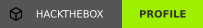

<!-- ═══════════ HEADER BANNER ═══════════ -->


<!-- ═══════════ TYPING ANIMATION ═══════════ -->
<!-- الكتابة المتحركة: كل سطر بعد lines= يفصله ; والمسافة تنكتب + -->
<div align="center">
  <a href="https://github.com/its-hixye">
    
  </a>
</div>

<br>

<div align="center">
  
  
</div>

---

##  About Me

```python
class Hixye:
    def __init__(self):
        self.name     = "hixye"
        self.role     = "Cybersecurity Learner"
        self.location = "Iraq 🇮🇶"
        self.interests = ["Web Security", "Forensics", "Cryptography", "Chess ♟️"]
        self.currently_learning = ["HTB CPTS"]
        self.motto = "Hack to learn, learn to protect."

    def say_hi(self):
        print("Thanks for visiting my profile! 👋")

Hixye().say_hi()
```

---

##  Skills

<div align="center">


<br><br>


</div>

---

##  Let's Connect

<div align="center">

<a href="https://github.com/its-hixye"></a>
<a href="https://t.me/j_tsw"></a>
<a href="https://tryhackme.com/p/hixye"></a>
<a href="https://profile.hackthebox.com/profile/019eed09-7e60-72bf-ab81-148e5849460e"></a>

</div>

<br>

<div align="center">
  <i>"The only truly secure system is one that is powered off." </i>
</div>

<!-- ═══════════ FOOTER ═══════════ -->

